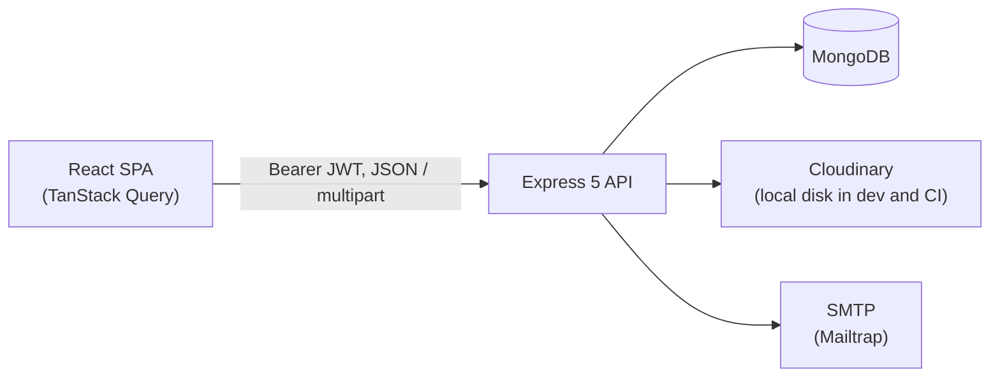

# Project Camp

A project-management app with per-project, role-based access control: an
Express 5 + MongoDB REST API, and a React 19 client with a drag-and-drop task
board, a cross-project "My tasks" view, due dates, priorities and progress.

- **Projects and roles.** Each project has its own admins, project admins and
  members. The API enforces every rule; the client only decides what to offer.
- **A board per project.** Drag cards between columns, filter by assignee,
  priority or text, sort by due date or priority, and open any task by URL.
- **My tasks.** Everything assigned to you across every project, grouped by
  overdue, today, this week and later.
- **Accounts that hold up.** Email verification, password reset, profile photos,
  and a password change that ends every session, including stolen ones.

## Architecture



Every request to `/api/v1` passes through the same pipeline:

```text
rate limit → verifyJWT → project-role guard → validator → controller → error handler
```

| Layer         | Where                                 | What it does                                                                                                               |
| ------------- | ------------------------------------- | -------------------------------------------------------------------------------------------------------------------------- |
| Role guard    | `src/middlewares/auth.middleware.js`  | Resolves the caller's role on `:projectId`; routes read as a permission table (`anyMember`, `managersOnly`, `adminsOnly`). |
| Validators    | `src/validators/index.js`             | `express-validator` rule sets; each ends in `validate`, which answers 422 per field.                                       |
| Controllers   | `src/controllers/`                    | Scope every query to the approved project; no `try/catch`, since Express 5 forwards rejected promises.                     |
| Error handler | `src/middlewares/error.middleware.js` | One pure `toApiError()` maps every error class to one JSON envelope.                                                       |
| Client data   | `frontend/src/lib/queries.ts`         | Query keys and hooks in one place; the optimistic card move lives here.                                                    |

## Design decisions

Each one is marked in the code with a `Decision:` comment, so
`grep -rn "Decision:" src frontend/src` lists them all.

| Decision                                                                                                                                                                   | Why                                                                                                                                                                                         |
| -------------------------------------------------------------------------------------------------------------------------------------------------------------------------- | ------------------------------------------------------------------------------------------------------------------------------------------------------------------------------------------- |
| **A project you are not in answers 404, not 403** ([auth.middleware.js](src/middlewares/auth.middleware.js))                                                               | A 403 would confirm the id exists. Child resources are scoped the same way, so a task id from another project is also a 404 (IDOR).                                                         |
| **A password change ends every session** ([user.models.js](src/models/user.models.js), [tokens.js](src/utils/tokens.js))                                                   | JWTs cannot be revoked one by one, but stamping `credentialsChangedAt` revokes every token issued before it. The refresh token is cleared too.                                              |
| **Secrets are opt-in** ([user.models.js](src/models/user.models.js))                                                                                                       | Every secret field is `select: false`, so code that never asks for it cannot leak it. A `toJSON` transform backstops what is loaded on purpose.                                             |
| **Sign-in leaks nothing** ([user.models.js](src/models/user.models.js))                                                                                                    | An unknown email and a wrong password get the same 401 and the same bcrypt cost; forgot-password always answers 200.                                                                        |
| **The unique index is the source of truth** ([auth.controllers.js](src/controllers/auth.controllers.js), [project.controllers.js](src/controllers/project.controllers.js)) | Registration and adding a member insert and let E11000 answer 409, instead of a check-then-act read that two requests can race. Registration is one write, not three round trips.           |
| **A project always keeps an admin** ([project.controllers.js](src/controllers/project.controllers.js))                                                                     | Role changes write, re-count admins, and undo themselves if the count hits zero. Without transactions (which need a replica set) this is what stops two admins demoting each other at once. |
| **Uploads are allowlisted twice and served apart** ([multer.middleware.js](src/middlewares/multer.middleware.js), [app.js](src/app.js))                                    | MIME type and extension must agree, and SVG is refused. Attachments always download; avatars render inline from their own directory.                                                        |
| **Local file deletes cannot escape** ([storage.js](src/utils/storage.js))                                                                                                  | A stored key like `../../src/app.js` is resolved and refused before `unlink`.                                                                                                               |
| **Single-flight token refresh** ([api.ts](frontend/src/lib/api.ts))                                                                                                        | The API rotates refresh tokens, so parallel 401s must share one refresh or they spend the same token twice.                                                                                 |
| **Optimistic card moves, with rollback** ([queries.ts](frontend/src/lib/queries.ts))                                                                                       | A drag that waits for the server feels broken; a refusal restores the exact previous board and says why in a toast.                                                                         |
| **Due dates are calendar days** ([display.ts](frontend/src/lib/display.ts))                                                                                                | Stored as UTC midnight and compared in UTC, so "3 Oct" never shows as "2 Oct" west of Greenwich.                                                                                            |

## Data model

| Collection       | Holds                                                                   | Indexes                             |
| ---------------- | ----------------------------------------------------------------------- | ----------------------------------- |
| `users`          | Account, avatar, hashed password and token hashes (all `select: false`) | `email` unique, `username` unique   |
| `projects`       | Name, description, creator                                              | —                                   |
| `projectmembers` | One role per user per project                                           | `{project, user}` unique, `{user}`  |
| `tasks`          | Status, priority, due date, assignee, attachments                       | `{project, status}`, `{assignedTo}` |
| `subtasks`       | Title, done flag, parent task                                           | `{task}`                            |
| `projectnotes`   | Admin-written notes                                                     | `{project}`                         |

`GET /projects` returns each project's member count and task counts by status in
one aggregation, computed by `$lookup` sub-pipelines rather than by loading the
rows it counts.

## API

All routes are under `/api/v1`. "Any" means any role on the project.

| Method                 | Route                                                                                                                             | Who                                             |
| ---------------------- | --------------------------------------------------------------------------------------------------------------------------------- | ----------------------------------------------- |
| `POST`                 | `/auth/register`, `/auth/login`, `/auth/refresh-token`, `/auth/forgot-password`, `/auth/reset-password/:token`                    | Public                                          |
| `GET`                  | `/auth/verify-email/:token`                                                                                                       | Public                                          |
| `GET` `POST` `PATCH`   | `/auth/current-user`, `/auth/logout`, `/auth/profile`, `/auth/avatar`, `/auth/change-password`, `/auth/resend-email-verification` | Signed in                                       |
| `GET`                  | `/me/tasks`                                                                                                                       | Signed in                                       |
| `GET` `POST`           | `/projects`                                                                                                                       | Signed in                                       |
| `GET` · `PUT` `DELETE` | `/projects/:projectId`                                                                                                            | Any · Admin                                     |
| `GET` · `POST`         | `/projects/:projectId/members`                                                                                                    | Any · Admin                                     |
| `PUT` `DELETE`         | `/projects/:projectId/members/:userId`                                                                                            | Admin                                           |
| `GET` · `POST`         | `/tasks/:projectId`                                                                                                               | Any · Manager                                   |
| `GET` · `PUT` `DELETE` | `/tasks/:projectId/t/:taskId`                                                                                                     | Any · Manager                                   |
| `DELETE`               | `/tasks/:projectId/t/:taskId/attachments/:attachmentId`                                                                           | Manager                                         |
| `POST`                 | `/tasks/:projectId/t/:taskId/subtasks`                                                                                            | Manager                                         |
| `PUT` · `DELETE`       | `/tasks/:projectId/st/:subTaskId`                                                                                                 | Any (tick only; rename needs Manager) · Manager |
| `GET` · `POST`         | `/notes/:projectId`                                                                                                               | Any · Admin                                     |
| `GET` · `PUT` `DELETE` | `/notes/:projectId/n/:noteId`                                                                                                     | Any · Admin                                     |

"Manager" is `admin` or `project_admin`. Tasks accept `title`, `description`,
`status`, `priority`, `assignedTo` and `dueDate`; sending `null` (or `""` in a
multipart form) clears the assignee or due date. Every response uses the same
envelope: `{ statusCode, data, message, success, errors }`.

## Running it

Requires Node 20+ and MongoDB.

```bash
cp .env.example .env            # then fill in MONGO_URI and the two secrets
npm install
npm run dev                     # API on http://localhost:8000

cd frontend
cp .env.example .env.local
npm install
npm run dev                     # client on http://localhost:5173

npm run seed                    # (from the root) two demo accounts, two projects
```

The seed prints the demo sign-ins; both use the password `DemoPass123!`.

Without Cloudinary credentials, uploads are written to `public/` and served by
the API, which is the right setting for development and CI. A deployed server
needs Cloudinary, because a PaaS filesystem is wiped on every redeploy.

### Upgrading an existing database

Project names used to be unique across the whole server, enforced by a
unique index called `name_1` on the `projects` collection. Mongoose creates
the indexes a schema declares, but never drops one the schema stops
declaring. So a database created before this change keeps refusing a second
project with an existing name until that index is dropped, once:

- **MongoDB Atlas:** Browse Collections, open `projects`, then the Indexes
  tab, and drop `name_1`.
- **mongosh:** `db.projects.dropIndex("name_1")`

A fresh database never has the index, which is why CI does not need this.

## Testing

| Command                   | What it covers                                                                                                          | Needs                                                       |
| ------------------------- | ----------------------------------------------------------------------------------------------------------------------- | ----------------------------------------------------------- |
| `npm test`                | Token freshness, upload path traversal, error mapping, link building                                                    | Nothing                                                     |
| `npm run verify`          | 26 end-to-end scenarios: RBAC, IDOR, upload allowlist, session revocation, last admin, My tasks scoping, cascade delete | A running API (`RATE_LIMIT_ENABLED=false`) and its database |
| `cd frontend && npm test` | 111 component and unit tests: board, drag and drop, rollback, permissions, auth refresh, forms                          | Nothing                                                     |

CI (`.github/workflows/ci.yml`) runs all three on every push, the end-to-end
suite against a real MongoDB service container, plus lint, formatting, a
typecheck, a production build and a boot check on a case-sensitive filesystem
(which catches import casing that Windows and macOS forgive).

Both projects lint with oxlint: typescript-eslint cannot load TypeScript 7, and
oxlint implements the React hooks rules natively. `tsc --noEmit` covers types.

## Configuration

See `.env.example` for every variable with a comment. The essentials:

| Variable                                                          | Purpose                                                      |
| ----------------------------------------------------------------- | ------------------------------------------------------------ |
| `MONGO_URI`                                                       | MongoDB connection string.                                   |
| `ACCESS_TOKEN_SECRET`, `REFRESH_TOKEN_SECRET`                     | JWT signing secrets; use different values.                   |
| `ACCESS_TOKEN_EXPIRY`, `REFRESH_TOKEN_EXPIRY`                     | e.g. `1d` and `10d`. Cookies expire with them.               |
| `SERVER_URL`                                                      | This API's own URL, used for locally stored file links.      |
| `CORS_ORIGIN`                                                     | Comma-separated client origins. Unset or `*` logs a warning. |
| `FORGOT_PASSWORD_REDIRECT_URL`, `EMAIL_VERIFICATION_REDIRECT_URL` | Client routes the emailed links open.                        |
| `CLOUDINARY_*`                                                    | All three set: uploads go to Cloudinary.                     |
| `TRUST_PROXY`                                                     | Proxy hops to trust, so rate limiting sees real client IPs.  |

## Future improvements

- **Pagination and server-side filtering.** The board filters in the browser
  because `GET /tasks/:projectId` returns a whole project. That is right for
  dozens of tasks and wrong for thousands; the fix is a cursor, then filters.
- **Card order within a column.** A drop sets the status; the position within
  the column needs a rank field (fractional indexing) and an endpoint for it.
- **Transactions.** The last-admin guard and project cascade use compensating
  writes; on a replica set they could become one transaction each.

## License

ISC
